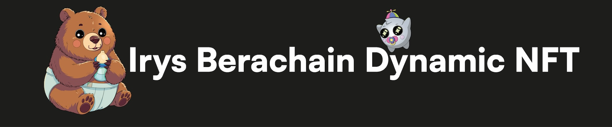

# Overview

The [Irys](https://irys.xyz/) [Berachain](https://www.berachain.com/) Dynamic NFT project uses [Irys's mutability feature](https://docs.irys.xyz/build/d/features/mutability) to create NFTs that evolve. As users accumulate BGT tokens, the metadata associated with their NFTs updates.

This repository is fully opensource. Users are encouraged to fork it, adapt the code, and deploy their own dynamic NFT projects.

## Repository Structure

This project is organized into two sub-repositories:

- [Contract](./contract/README.md): The smart contract and hardhat project.
- [NextJS](./nextjs/README.md): The front-end using Next.js for interacting with the NFT and smart contract.

## See It In Action

Go mint an NFT yourself:

https://beramint.irys.xyz/